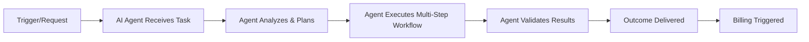
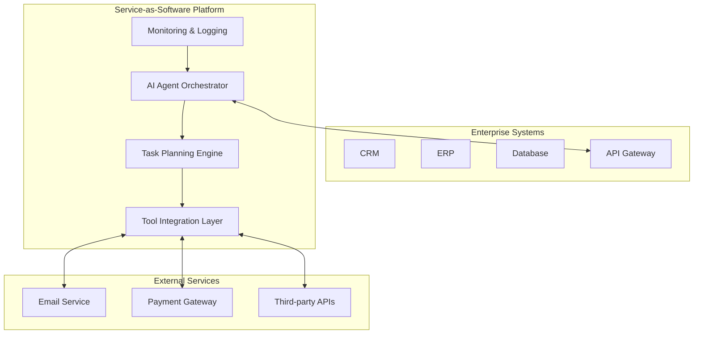
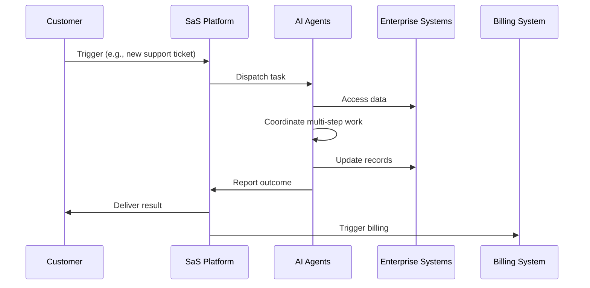

# 02 - What is Service-As-Software and How It Works

> **Research Sources:** See [Research Appendix in README.md](README.md#research-appendix-sources) for complete bibliography.

## How Service-As-Software Works

### The Core Mechanism

Service-as-Software represents a fundamental shift from providing tools to delivering outcomes through autonomous AI agents. The model operates on several key principles:

#### 1. Autonomous Task Execution

AI agents perform entire workflows from start to finish without human intervention:

**Key characteristics:**
- **Multi-step reasoning**: Agents can break down complex tasks into subtasks
- **Tool use**: Agents can invoke APIs, databases, and external services
- **Error handling**: Agents can detect failures and retry or adapt
- **Self-correction**: Agents can validate their own outputs

#### 2. Outcome-Based Pricing

The economic model is fundamentally different from traditional SaaS:

| Pricing Dimension | SaaS Model | Service-as-Software |
|-------------------|------------|---------------------|
| **Unit of measure** | User/seat | Outcome delivered |
| **Payment timing** | Recurring subscription | Per-completion or hybrid |
| **Risk allocation** | Buyer (pays regardless of usage) | Shared (seller takes on execution risk) |
| **Revenue model** | ARR (Annual Recurring Revenue) | Usage-based + success metrics |

**Examples of outcome-based pricing:**
- Customer support: Pay per resolved ticket (e.g., $2-5 per ticket)
- Lead qualification: Pay per qualified lead (e.g., $10-20 per lead)
- Claims processing: Pay per successfully processed claim
- Data extraction: Pay per successfully extracted record
- Content generation: Pay per approved piece of content

#### 3. Minimal User Interface

Service-as-Software systems often have little or no traditional UI:

> "SaS products have minimal UI. The software runs in the background, often with AI agents performing work autonomously. The user may never even see the software; they simply receive completed work." — [Thoughtworks: Service-as-software: A new economic model for age of AI agents](https://www.thoughtworks.com/en-us/insights/blog/generative-ai/service-as-software-a-new-economic-model-for-age-of-ai-agents)

**What users experience:**
- Dashboard showing completed work and metrics
- Notifications when outcomes are delivered
- Exception handling UI for edge cases
- Configuration interfaces for rules and parameters

#### 4. Integration Architecture

Service-as-Software systems integrate deeply with existing enterprise systems:

**Integration capabilities:**
- **API connections**: REST, GraphQL, webhooks
- **Database access**: Direct read/write to customer data
- **Event-driven architecture**: Reacts to business events
- **Workflow orchestration**: Coordinates multiple systems

### Technical Architecture

#### Multi-Agent Systems

Service-as-Software platforms typically use multi-agent architectures:

| Agent Type | Responsibility |
|------------|---------------|
| **Planner Agent** | Breaks down complex tasks into steps |
| **Executor Agents** | Perform specific actions (API calls, data processing) |
| **Validator Agent** | Checks results against quality criteria |
| **Recovery Agent** | Handles failures and retries |
| **Reporting Agent** | Generates metrics and reports |

#### Example: Customer Support Service-as-Software

1. **Incoming ticket** → **Classifier Agent** categorizes the issue
2. **Planner Agent** determines resolution strategy
3. **Knowledge Search Agent** searches documentation
4. **Response Agent** drafts response
5. **Quality Agent** validates accuracy
6. **Delivery Agent** sends response to customer
7. **Billing Agent** records successful resolution

### Operational Model

#### The Workflow

#### Quality Assurance Mechanisms

Service-as-Software systems include built-in quality controls:

1. **Automated validation**: Rules-based checks on outputs
2. **Human review queue**: Edge cases routed to humans
3. **Continuous learning**: Agents improve from feedback
4. **Performance monitoring**: Real-time tracking of success rates
5. **SLA compliance**: Automatic enforcement of service levels

### The Trust Layer
### The Trust Layer:

A critical component of Service-as-Software is the trust layer:

> "SaS is built on a foundation of trust. The software must be reliable, secure and compliant. This requires robust monitoring, validation, and human oversight." — [Thoughtworks: Service-as-software: A new economic model for age of AI agents](https://www.thoughtworks.com/en-us/insights/blog/generative-ai/service-as-software-a-new-economic-model-for-age-of-ai-agents)

**Trust mechanisms include:**
- **Explainability**: Ability to trace agent decisions
- **Audit trails**: Complete logs of all actions
- **Compliance frameworks**: SOC 2, HIPAA, GDPR adherence
- **Transparency dashboards**: Real-time visibility into operations
- **Human-in-the-loop**: Critical decisions require human approval

#### Legal and Regulatory Requirements for Trust

> **Note:** For comprehensive coverage of legal and regulatory requirements, see [14-Legal-and-Regulatory-Perspective-Service-As-Software](14-Legal-and-Regulatory-Perspective-Service-As-Software.md)

**Key Requirements:**
- **Transparency**: Users must be informed when interacting with AI systems
- **Human Oversight**: Critical decisions require human approval and escalation procedures
- **Technical Documentation**: Comprehensive documentation of system architecture and risk mitigation
- **Record Keeping**: Automatic logging of AI events with audit trails
- **Compliance**: Adherence to applicable regulations (GDPR, AI Act, HIPAA, PCI DSS, NIS2, etc.)

**See Also:**
- [14-Legal-and-Regulatory-Perspective-Service-As-Software](14-Legal-and-Regulatory-Perspective-Service-As-Software.md) - Comprehensive legal and regulatory analysis
### Comparison with Traditional Service Models

| Aspect | Professional Services | SaaS | Service-as-Software |
|---------|---------------------|------|---------------------|
| **Human involvement** | High (people do work) | Medium (people use tools) | Low (AI does work) |
| **Scalability** | Limited (people constraint) | High (software scales) | Very High (AI agents scale) |
| **Cost structure** | Labor-intensive | Fixed + variable | Marginal cost near zero |
| **Consistency** | Variable | High | Very High |
| **Customization** | Very High | Medium | High (through configuration) |
| **Speed** | Slow | Fast | Very Fast |

### Real-World Examples

#### Example 1: AI-Powered Payroll Service

**Traditional approach:** Payroll software + HR team running it monthly
**Service-as-Software approach:**
- AI monitors employee data changes
- Automatically calculates payroll
- Processes payments
- Files taxes
- Generates reports
- Customer pays per payroll run or per employee processed

#### Example 2: Lead Qualification Service

**Traditional approach:** Sales team manually qualifies leads
**Service-as-Software approach:**
- AI ingests new leads from multiple sources
- Researches each company
- Scores lead quality
- Sends personalized outreach
- Schedules qualified meetings
- Customer pays per qualified meeting booked

#### Example 3: Healthcare Claims Processing

**Traditional approach:** Claims adjusters review and process claims
**Service-as-Software approach:**
- AI receives claim data
- Validates against policy rules
- Cross-references medical records
- Makes approval/rejection decision
- Generates explanation
- Customer pays per successfully processed claim

## Key Takeaways

1. **Autonomy**: Service-as-Software systems work autonomously, not as tools humans operate
2. **Outcomes over access**: Customers pay for completed work, not software access
3. **Minimal UI**: The software is largely invisible to end users
4. **Deep integration**: Systems connect directly to enterprise data and workflows
5. **Shared risk**: Pricing aligns incentives between buyer and seller
6. **Trust foundation**: Reliability, security, and compliance are essential

---

## Next Steps

- [03-Competitive-Advantages-and-Benefits](03-Competitive-Advantages-and-Benefits.md) - Why this model creates competitive advantage
- [04-Market-Predictions-and-Forecasts](04-Market-Predictions-and-Forecasts.md) - Market size and growth projections
- [05-Industry-Segments-and-Use-Cases](05-Industry-Segments-and-Use-Cases.md) - Where this model applies
