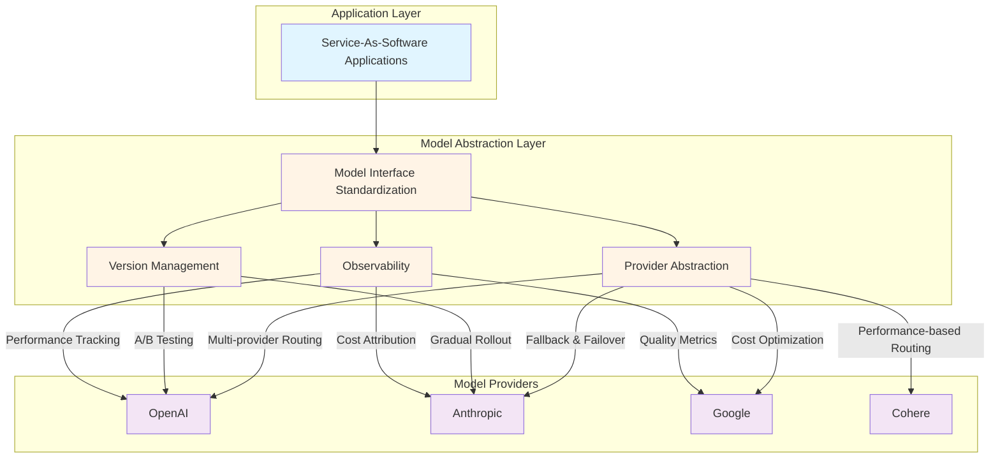
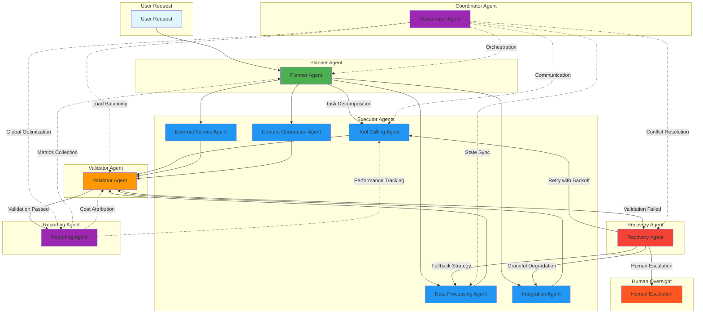
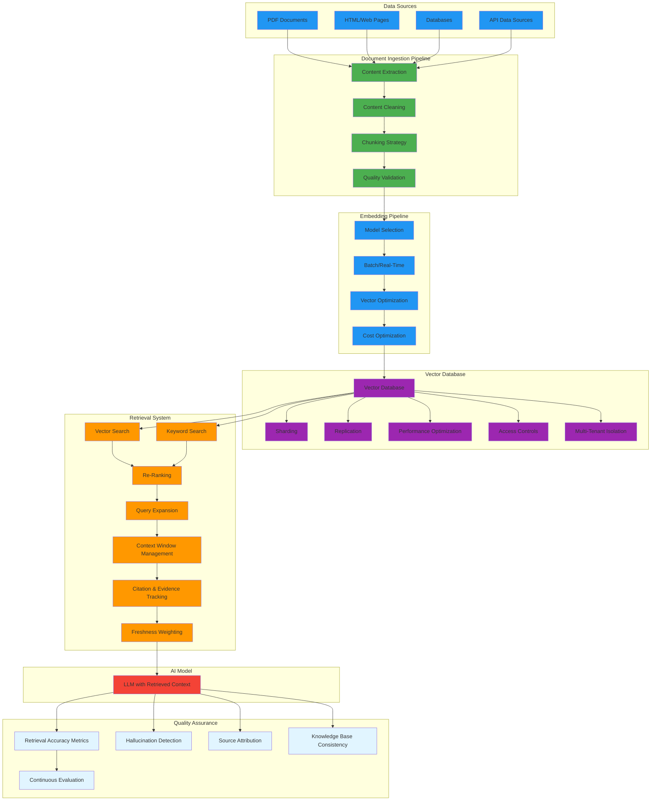
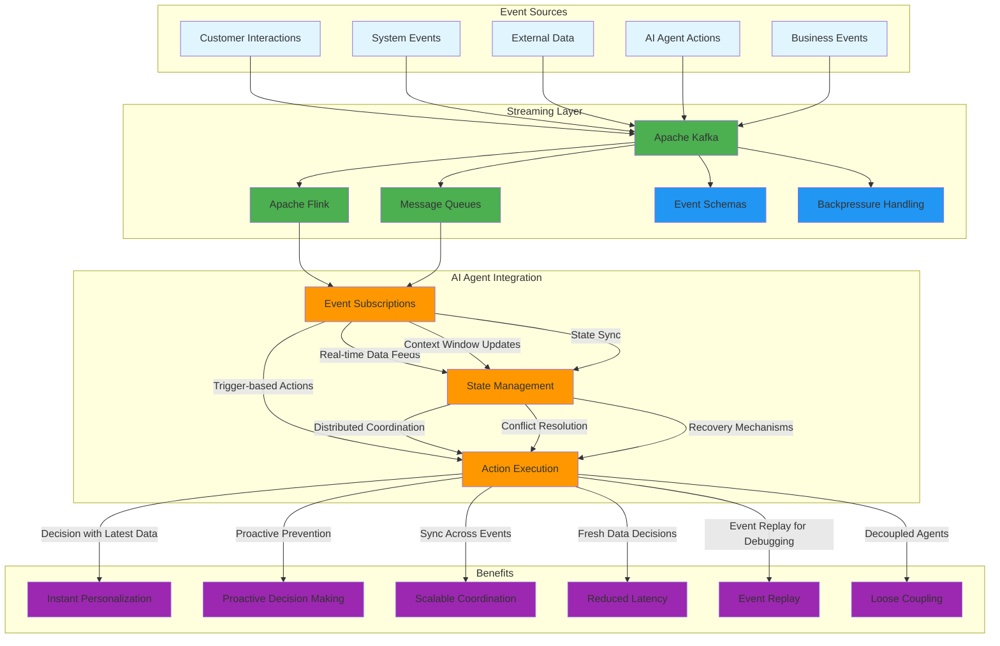
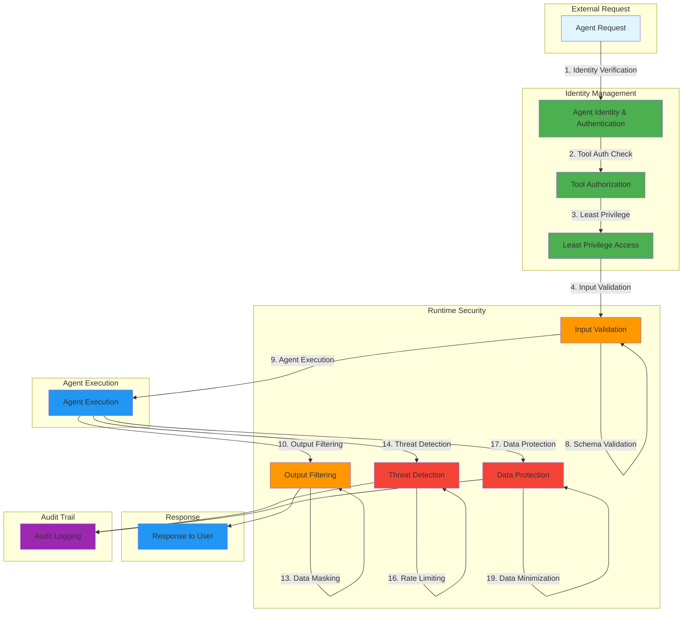

# 17 - Architectural Perspective: Service-As-Software

> **Research Sources:** See [Research Appendix in README.md](README.md#research-appendix-sources) for complete bibliography.

## Overview

Service-As-Software (SaS) represents a fundamental paradigm shift that demands entirely new approaches to enterprise architecture. Unlike traditional SaaS where software serves as a tool for humans to operate, SaS systems operate autonomously, making architectural decisions and executing workflows without human intervention. This transformation requires architects to evolve from system designers to **orchestrators of autonomous intelligence**.

The architectural perspective for Service-As-Software encompasses three critical layers:

1. **Enterprise Architecture (EA)** - Strategic alignment and governance
2. **System Architecture** - Technical design and integration patterns
3. **Application Architecture** - Service-specific implementation patterns

Each layer faces unique challenges and requires new competencies, patterns, and design principles. This document provides a comprehensive analysis of the current state, emerging patterns, skill requirements, and practical guidance for architects building Service-As-Software solutions.

---

## Part 1: Current State (2025-2026)

### Market Reality

```
Service-As-Software Architectural Landscape (2025-2026):
├── Paradigm Shift: From tool-centric to outcome-centric architecture
├── Maturity: Early adoption (5-10%), mainstream (2027-2028)
├── Key Challenge: 40%+ of AI projects fail due to architectural issues
├── Gartner Prediction: 40% of enterprise apps will have AI agents by 2026
├── Technology Readiness: 35% of enterprises have AI-ready architecture
└── Talent Gap: 3-5x premium for AI architecture skills
```

### Technology Maturity

| Technology Area | Maturity Level | Production Readiness | Key Challenges |
|---------------|----------------|---------------------|-------------------|
| **Multi-Agent Architecture** | Medium-High | Early-mid production | Coordination complexity, failure recovery, state management |
| **Model-Agnostic Design** | Medium | Early adoption | Vendor lock-in, model swap complexity, cost optimization |
| **RAG Architecture** | Medium-High | Production-ready | Retrieval accuracy (70-85%), vector DB selection, scaling costs |
| **AI-Native Security** | Low-Medium | Emerging frameworks | Prompt injection, data leakage, model poisoning, zero-trust for agents |
| **LLMOps/LLMOps** | Low-Medium | Early adoption | Tool fragmentation, metrics definition, cost attribution |
| **Event-Driven Architecture** | Medium-High | Production-ready | Event ordering, backpressure handling, real-time coordination |
| **Legacy Integration** | Low-Medium | Pilot to early production | API compatibility, data synchronization, security model alignment |

### Architectural Paradigm Shift

```
Traditional Enterprise Architecture → AI-Native Architecture:

Traditional Enterprise Architecture:
├── Focus: System-of-Record (SoR) management
├── Decision Making: Human-driven, deterministic
├── Structure: Hierarchical, layered (business, application, data, infrastructure)
├── Integration: Point-to-point APIs, batch processing
├── State: Centralized, predictable
├── Architecture Patterns: Monolith → Microservices → Event-Driven
├── Value: Stability, efficiency, cost control
└── Governance: Compliance, standards, change management boards

AI-Native Enterprise Architecture:
├── Focus: Outcome delivery through autonomous agents
├── Decision Making: AI-driven, probabilistic, explainable
├── Structure: Agent-based, orchestration layers, knowledge graphs
├── Integration: Context-aware, real-time, tool-based
├── State: Distributed, emergent, continuously evolving
├── Architecture Patterns: Multi-Agent Systems → Agent-Oriented Architecture → Cognition Architecture
├── Value: Adaptability, intelligence, continuous improvement
└── Governance: AI ethics, explainability, human oversight, compliance automation
```

### Key Insight

> "The architecture that works for SaaS will not work for AI-native systems. We need to fundamentally rethink how we design systems around autonomy, intelligence, and continuous evolution." — [Source: Catio.tech](https://www.catio.tech/blog/emerging-architecture-patterns-for-the-ai-native-enterprise)

---

## Part 2: Core Architectural Principles for Service-As-Software

### 2.1 Model-Agnostic Architecture

**Principle**: Design systems that can easily swap between AI models without architectural rewrites.

**Implementation Requirements:**

```
Model Abstraction Layer:
├── Model Interface Standardization
│   ├── Standardized prompt/response formats
│   ├── Consistent tool calling conventions
│   └── Model capability discovery and registration
├── Provider Abstraction
│   ├── Multi-provider routing strategies
│   ├── Fallback and failover mechanisms
│   ├── Cost optimization routing (cost-aware model selection)
│   └── Performance-based routing (latency-aware model selection)
├── Version Management
│   ├── Model versioning and rollback capabilities
│   ├── A/B testing infrastructure for model comparison
│   └── Gradual rollout strategies
└── Observability
    ├── Model performance tracking
    ├── Token usage and cost attribution
    ├── Quality metrics per model
    └── Explainability of model decisions

Strategic Benefits:
├── Vendor Lock-In Avoidance: Easy migration between OpenAI, Anthropic, Google, Cohere
├── Cost Optimization: Route to cheapest model for task requirements
├── Performance Optimization: Use fastest model for latency-sensitive tasks
├── Innovation Readiness: Quickly adopt new models as they emerge
├── Risk Mitigation: Model provider failures don't cripple system
└── Competitive Advantage: Always use best available model

Challenges:
├── Interface Inconsistency: Different models have different capabilities and APIs
├── Cost Attribution Difficulty: Complex workflows make cost tracking hard
├── Testing Complexity: Need to test against multiple models continuously
├── Model Drift: Models improve over time, requiring continuous re-evaluation
└── Prompt Engineering Overhead: Different models respond better to different prompt styles
```

**Model-Agnostic Architecture Diagram:**



### 2.2 Multi-Agent System Architecture

**Principle**: Design systems where multiple specialized AI agents collaborate to achieve complex outcomes.

**Agent Specialization Pattern:**

```
Multi-Agent Architecture Roles:

Planner Agent:
├── Task decomposition and planning
├── Dependency management
├── Resource allocation
├── Risk assessment
├── Timeline estimation
└── Decision coordination

Executor Agents:
├── Tool Calling Agent: API interactions, database operations
├── Data Processing Agent: ETL, transformations, analysis
├── Integration Agent: Legacy system connectors
├── External Service Agent: Third-party API calls
└── Content Generation Agent: Text, code, media

Validator Agent:
├── Quality checks and validation
├── Business rule compliance
├── Output formatting verification
├── Consistency checks
└── Accuracy assessment

Recovery Agent:
├── Error detection and classification
├── Retry logic with exponential backoff
├── Fallback strategy activation
├── Graceful degradation
└── Human escalation triggers

Coordinator Agent:
├── Workflow orchestration
├── Agent communication protocols
├── State synchronization
├── Load balancing
├── Conflict resolution
└── Global optimization

Reporting Agent:
├── Metrics collection and aggregation
├── Performance tracking
├── Cost attribution
├── Audit trail generation
└── SLA compliance monitoring
```

**Multi-Agent System Architecture Diagram:**



**Critical Failure Pattern:**

> "Agent systems break on coordination, not inference. At ~5 agents, GPU throughput stays flat, p99 latency explodes due to serialized handoffs." — [Source: Stack.ai](https://medium.com/@bijit211987/why-multi-agent-systems-fail-at-scale-and-why-simplicity-always-wins-7490f9002a9b)

**Key Architectural Challenges:**

1. **State Management**
   - Distributed agent state across multiple agents
   - Conflict resolution when agents disagree
   - State consistency guarantees
   - State persistence and recovery
   - Distributed transactions and rollbacks

2. **Communication Protocols**
   - Agent-to-agent message formats
   - Asynchronous vs. synchronous communication
   - Message reliability and ordering guarantees
   - Broadcast vs. point-to-point patterns
   - Event-driven agent coordination

3. **Failure Recovery**
   - Detecting agent failures quickly
   - Isolating failed agents to prevent cascade
   - Automatic retry with backoff strategies
   - Fallback to simpler agents or human oversight
   - Graceful degradation under load

4. **Coordination Complexity**
   - Deadlock prevention in agent interactions
   - Resource contention management
   - Load balancing across agent pools
   - Priority-based task routing
   - Timeout management

### 2.3 RAG (Retrieval-Augmented Generation) Architecture

**Principle**: Augment AI models with domain-specific knowledge to improve accuracy and reduce hallucinations.

**RAG Architecture Components:**

```
RAG System Architecture:

Knowledge Base Management:
├── Document Ingestion Pipeline
│   ├── Multi-format support (PDF, HTML, databases)
│   ├── Content extraction and cleaning
│   ├── Chunking strategy design
│   ├── Quality validation before embedding
│   └── Freshness tracking
├── Embedding Pipeline
│   ├── Model selection (OpenAI, Cohere, SentenceTransformers)
│   ├── Batch vs. real-time embedding
│   ├── Vector dimension optimization (768 vs. 1536)
│   └── Cost optimization (caching, batching)
├── Vector Database
│   ├── Platform selection (Pinecone, Milvus, Qdrant, pgvector)
│   ├── Sharding and replication for scale
│   ├── Performance optimization (P99 latency <100ms)
│   ├── Access controls and security
│   └── Multi-tenant isolation
└── Retrieval System
    ├── Hybrid search (vector + keyword)
    ├── Re-ranking models for accuracy
    ├── Query expansion and optimization
    ├── Context window management
    ├── Citation and evidence tracking
    └── Freshness weighting

Quality Assurance:
├── Retrieval accuracy metrics (85-95% target)
├── Hallucination detection and mitigation
├── Source attribution and verification
├── Knowledge base consistency
└── Continuous evaluation and improvement
```

**RAG System Architecture Diagram:**



**Critical Trade-offs:**

| Decision Factor | Option A | Option B | Option C | Recommendation |
|---------------|----------|----------|---------------|
| **Vector DB Scale** | <10M: pgvector | 10-100M: Milvus, Chroma | 100M-1B: Pinecone, Qdrant | 1B+: Pinecone Enterprise, Weaviate |
| **Cost Priority** | Performance | Balance | Cost | Balance for early-stage |
| **Latency Target** | <50ms | <100ms | <200ms | <100ms for production |
| **Retrieval Strategy** | Vector only | Hybrid (vector+keyword) | Graph RAG | Hybrid with re-ranking |

### 2.4 Event-Driven Architecture

**Principle**: Design systems where AI agents react to real-time events for coordination and state updates.

**Event-Driven Patterns for AI Agents:**

```
Event-Driven AI Agent Architecture:

Event Sources:
├── Customer Interactions (clicks, searches, transactions)
├── System Events (errors, status changes, alerts)
├── External Data (market data, social signals, news)
├── AI Agent Actions (decisions, tool calls, outcomes)
└── Business Events (orders, shipments, updates)

Streaming Layer:
├── Apache Kafka (event streaming backbone)
├── Apache Flink (stream processing)
├── Message Queues (RabbitMQ, SQS)
├── Event Schemas (Avro, Protobuf, JSON Schema)
└── Backpressure Handling (flow control, buffering)

AI Agent Integration:
├── Event Subscriptions
│   ├── Real-time data feeds
│   ├── Context window updates
│   ├── State synchronization
│   └── Trigger-based actions
├── State Management
│   ├── Agent state stores
│   ├── Distributed coordination
│   ├── Conflict resolution
│   └── Recovery mechanisms
└── Action Execution
    ├── Tool calling with real-time context
    ├── Decision-making with latest data
    ├── Workflow orchestration
    └── Result publishing

Benefits:
├── Instant Personalization: Agents adapt to real-time user behavior
├── Proactive Decision Making: Predict and prevent issues before impact
├── Scalable Coordination: Multi-agent systems sync across events
├── Reduced Latency: Decisions made with fresh data
├── Event Replay: Debug and improve agent behavior by replaying events
└── Loose Coupling: Event-driven decouples agents same way it decoupled microservices
```

**Event-Driven AI Agent Architecture Diagram:**



### 2.5 AI-Native Security Architecture

**Principle**: Apply zero-trust principles to AI agents and systems handling sensitive data and operations.

**Zero-Trust for AI Agents:**

```
Zero-Trust AI Security Architecture:

Identity Management:
├── Agent Identity and Authentication
│   ├── Unique agent identifiers
│   ├── Cryptographic identity verification
│   ├── Short-lived credentials
│   └── Continuous verification
├── Tool Authorization
│   ├── Fine-grained permissions per tool
│   ├── Dynamic authorization based on context
│   └── Just-in-time access granting
└── Least Privilege Access
    ├── Minimum necessary permissions
    ├── Time-bound access tokens
    ├── Resource-level isolation
    └── Audit logging

Runtime Security:
├── Input Validation
│   ├── Prompt injection detection
│   ├── Malicious input filtering
│   ├── Sanitization and normalization
│   └── Schema validation
├── Output Filtering
│   ├── Content security filters
│   ├── PII redaction
│   ├── Sensitive data masking
│   └── Behavioral analysis
├── Threat Detection
│   ├── Anomaly detection in agent behavior
│   ├── Rate limiting and throttling
│   ├── Unusual pattern recognition
│   └── Automated response
└── Data Protection
    ├── Encryption at rest and in transit
    ├── Data minimization
    ├── Differential privacy techniques
    └── Audit logging
```

**Zero-Trust AI Security Architecture Diagram:**



**AI-Specific Threat Mitigation:**

| Threat Type | Description | Mitigation Strategy | Architectural Consideration |
|------------|-------------|-------------------|-------------------------|
| **Prompt Injection** | Malicious inputs manipulate agent behavior | Input validation, system prompt hardening, output filtering, privilege minimization |
| **Data Leakage** | Agents expose sensitive information | Zero-trust access controls, data minimization, output filtering, audit logging |
| **Model Poisoning** | Corrupted training data causes malicious behavior | Data provenance tracking, supply chain security, model scanning, regular retraining |
| **Tool Abuse** | Agents exploit authorized tool access | Tool authorization, rate limiting, monitoring, anomaly detection |
| **Cascade Failures** | Single agent failure propagates through system | Circuit breakers, redundancy, graceful degradation, isolation mechanisms |

### 2.6 Legacy System Integration Architecture

**Principle**: Design integration patterns that bridge modern AI systems with existing enterprise systems.

**Legacy Integration Challenges:**

```
Legacy Integration Complexity (3.5x more complex than typical SaaS):

Technical Challenges:
├── Outdated AI Legacy Systems
│   ├── Lack of modern APIs (REST, GraphQL)
│   ├── Brittle and temperamental infrastructure
│   ├── Unorganized data structures
│   └── Poor documentation
├── Data Synchronization Issues
│   ├── Real-time data access limitations
│   ├── Batch-only processing paradigms
│   └── Data quality and consistency problems
├── Security Model Mismatches
│   ├── Legacy systems designed for human operators
│   ├── Lack of granular access controls
│   ├── No API rate limiting or throttling
│   └── Audit trail limitations
└── Operational Complexity
    ├── Change management processes
    ├── Manual deployment procedures
    ├── Limited monitoring capabilities
    ├── No automated rollback mechanisms
    └── Extended downtime windows

Strategic Risks:
├── 40% of agentic AI projects fail by 2027 due to legacy systems (Gartner)
├── Extended integration timelines (2-3x longer than expected)
├── Hidden compatibility issues discovered post-deployment
├── Performance bottlenecks in legacy systems
└── Security vulnerabilities from exposing legacy systems to AI agents
└── Data quality issues causing AI model failures
```

**Integration Patterns:**

```
Legacy Integration Architecture Patterns:

Anti-Corruption Layer:
├── Event Sourcing
│   ├── Read-only access to legacy systems
│   ├── Event-based change detection
│   ├── Immutable data snapshots
│   └── Audit trails for all changes
├── Adapter Pattern
│   ├── Standardized legacy system adapters
│   ├── Protocol translation (legacy protocols to modern APIs)
│   ├── Data transformation (legacy formats to modern)
│   └── Error handling and translation
└── Caching Layer
    ├── Read-through cache for legacy data
    ├── Write-through cache for optimization
    ├── Cache invalidation strategies
    └── Performance monitoring

API Gateway Layer:
├── Unified entry point for legacy systems
├── Request routing and load balancing
├── API versioning and deprecation
├── Rate limiting and throttling
├── Authentication and authorization
├── Request/response transformation
├── Monitoring and observability
└── Event-Driven Integration
    ├── Change data capture events
    ├── Event streaming for real-time updates
    ├── Webhook subscriptions
    └── Asynchronous processing patterns

Data Synchronization Layer:
├── CDC (Change Data Capture)
├── Event streaming for real-time sync
├── Conflict resolution (last-write-wins)
├── Data quality validation
├── Consistency checks across systems
└── Error handling and retry logic
```

---

## Part 3: Enterprise Architecture (EA) Perspective

### 3.1 Social Lens Architecture

**Principle**: Map people, teams, and social structures alongside technical systems to enable better decision-making.

> "In 2025, ability to map the social aspects of an organization will become an increasingly valuable practice for Enterprise Architects. As digitalization accelerates across industries, it's no longer just about systems, applications, and processes. It's about people—and how they interact within the architecture of the enterprise." — [Source: Ardoq](https://www.ardoq.com/blog/the-biggest-trends-in-ea)

**Social Architecture Components:**

```
Social Lens Implementation:

Team Mapping:
├── Organizational structure visualization
├── Team collaboration patterns and handoffs
├── Communication flow analysis
├── Decision-making authority mapping
├── Skill inventory and capabilities
├── Workflow dependency mapping
└── Bottleneck identification

People-Centric Design:
├── User journey mapping across systems
├── Stakeholder impact analysis
├── Change readiness assessment
├── Training needs identification
└── Support system optimization

Integration with AI:
├── AI-powered team optimization recommendations
├── Skill gap analysis using AI
├── Organizational redesign simulation
├── Change impact prediction
└── Communication pattern optimization
```

### 3.2 AI-Enhanced Enterprise Architecture

**Principle**: Leverage AI to accelerate EA processes while ensuring governance and compliance.

**AI-Enhanced EA Capabilities:**

```
AI-Enhanced Enterprise Architecture:

Automated Discovery:
├── Automated application inventory and mapping
├── Technology dependency analysis
├── Data lineage visualization
├── Business process discovery (process mining)
├── Capability gap identification
└── Risk assessment and scoring

Future State Modeling:
├── Multiple "to-be" scenario simulation
├── Impact analysis of strategic decisions
├── Technology roadmap optimization
├── Cost forecasting and scenario analysis
├── Resource allocation optimization
└── Regulatory compliance checking

AI-Driven Insights:
├── Pattern recognition in EA data
├── Anomaly and outlier detection
├── Optimization recommendations
├── Predictive analytics for EA metrics
└── Natural language querying of EA repository

Strategic Alignment:
├── Business capability mapping
├── Strategic initiative tracking
├── Investment prioritization
├── ROI measurement and optimization
└── Portfolio rationalization support
```

### 3.3 Compliance-First Architecture

**Principle**: Design architecture that inherently supports regulatory requirements rather than retrofitting compliance later.

**Compliance Architecture Considerations:**

```
Compliance-First Architecture:

EU AI Act Integration:
├── Risk Management System
│   ├── Automated risk classification
│   ├── Impact assessment
│   ├── Mitigation measure documentation
│   └── Continuous monitoring
├── Technical Documentation
│   ├── System architecture documentation
│   ├── Model specifications
│   ├── Performance metrics
│   └── Security measures
├── Quality Management
│   ├── Data quality controls
│   ├── Model validation
│   └── Testing procedures
├── Conformity Assessment
│   ├── Self-assessment procedures
│   ├── Third-party assessment options
│   └── CE marking preparation
└── Human Oversight Framework
    ├── Automated decision detection
    ├── Human intervention triggers
    ├── Explanation generation
    ├── Appeal mechanisms
    └── Audit trail maintenance

NIS2/DORA Compliance:
├── Supply chain security management
├── Incident response and reporting (24-hour warning)
├── Business continuity and crisis management
├── Regular security assessments
├── Vulnerability management
└── Cybersecurity as board-level responsibility

GDPR Article 22 Implementation:
├── Right to human intervention
├── Right to explanation
├── Right to challenge
├── Profiling restrictions
├── Consent management
├── Data minimization
├── Right to erasure
└── Audit trail for automated decisions
```

---

## Part 4: System Architecture Perspective

### 4.1 Reference Architecture Patterns

**Principle**: Apply proven architectural patterns to Service-As-Software while adapting for AI-specific requirements.

```
Service-As-Software Architecture Patterns:

Microservices with Agent Orchestration:
├── Service boundaries around business capabilities
├── Each service manages its own agent pool
├── Inter-service communication through events
├── Independent scaling and deployment
├── Circuit breakers for failure isolation
├── Observability per service
└── API gateway for external access

Hexagonal Architecture (Ports and Adapters):
├── Domain core with business logic
├── Adapter layers for legacy systems
├── Agent orchestration in core
├── Infrastructure adapters (databases, messaging)
├── Testing adapters for validation
└── Clear separation of concerns

Event-Driven Architecture:
├── Event sourcing for audit trails
├── CQRS for read/write optimization
├── Event choreography for complex workflows
├── Saga pattern for distributed transactions
├── Event replay for debugging
└── Backpressure handling for scalability

Data Mesh:
├── Domain-oriented data ownership
├── Self-serve data platforms
├── Federated computational governance
├── Data as product mindset
└── Cross-domain data sharing through events
```

### 4.2 Infrastructure Architecture

**Principle**: Design infrastructure that supports AI workloads with optimal cost and performance.

```
AI Infrastructure Architecture:

GPU Infrastructure:
├── Multi-cloud GPU strategy (AWS, GCP, Azure)
├── Spot instances for cost optimization
├── Auto-scaling GPU clusters
├── GPU orchestration and scheduling
├── Cost optimization through right-sizing
└── Multi-region deployment for latency

Vector Database Infrastructure:
├── Vector DB selection based on scale
├── Sharding and replication strategies
├── Performance optimization (P99 latency targets)
├── Multi-tenant isolation
├── Backup and disaster recovery
└── Migration tools and strategies

Streaming Infrastructure:
├── Apache Kafka for event streaming
├── Apache Flink for stream processing
├── Event schema management
├── Backpressure handling
├── Exactly-once semantics
└── Event replay capabilities

Observability Stack:
├── Distributed tracing (Jaeger, OpenTelemetry)
├── Metrics collection (Prometheus, Grafana)
├── Logging infrastructure (ELK, Loki)
├── Agent behavior tracking
└── Performance monitoring
└── Alerting and anomaly detection

Storage Architecture:
├── Object storage for unstructured data
├── Database selection for structured data
├── Data lake for analytics
├── Backup and retention policies
└── Cost optimization through tiered storage
```

### 4.3 Application Architecture for Service-As-Software

**Principle**: Design applications that minimize UI and maximize autonomous agent operation.

```
Service-As-Software Application Architecture:

Minimal UI Design:
├── Dashboard for monitoring and metrics
├── Configuration interfaces for rules and parameters
├── Exception handling UI for edge cases
├── Human review queues
├── Approval gates for critical actions
└── Feedback collection interfaces

Headless Architecture:
├── API-first design with minimal UI
├── Webhook-based integrations
├── Mobile app interfaces for monitoring
├── Chat interfaces for conversational interaction
└── Voice interfaces for accessibility

State Management:
├── Agent state persistence
├── Workflow state tracking
├── Session management
├── Distributed state synchronization
└── State recovery and rollback

Error Handling:
├── Graceful degradation strategies
├── Automatic retry with backoff
├── Fallback to simpler agents
�── Human escalation triggers
└── Error categorization and routing
```

---

## Part 5: Skills and Competency Transformation

### 5.1 Current vs. Required Skills

**Traditional Architect Skills → Service-As-Software Architect Skills:**

| Skill Area | Traditional Architect Skills | Service-As-Software Architect Skills | Gap Severity |
|------------|-------------------------|---------------------------|--------------|
| **System Design** | Monolith, microservices, event-driven | Multi-agent systems, agent orchestration, model-agnostic design | High |
| **Data Architecture** | Relational databases, data lakes | Vector databases, RAG architectures, knowledge graphs | High |
| **Security Architecture** | Network security, IAM, encryption | AI-native security (prompt injection, zero-trust for agents), model poisoning protection | Critical |
| **Integration Architecture** | REST APIs, message queues | Event-driven integration, tool-based integration, legacy system adapters | High |
| **Observability** | Logging, metrics, monitoring | Agent tracing, behavioral validation, decision logging, cost attribution | Critical |
| **Cost Optimization** | Cloud cost management | GPU optimization, token optimization, model cost tracking | High |
| **Compliance** | GDPR, SOC 2 | EU AI Act, GDPR Article 22, NIS2, automated compliance | Critical |
| **AI/ML Knowledge** | Understanding of ML concepts | LLM fine-tuning, RAG implementation, prompt engineering, multi-agent coordination | Critical |
| **Domain Modeling** | Business process modeling | AI workflow modeling, agent capability modeling | High |

### 5.2 Emerging Architectural Roles

```
New Architectural Roles for Service-As-Software:

AI Architect:
├── Model strategy and selection
├── Multi-agent system design
├── RAG architecture oversight
├── AI security architecture
├── Cost optimization strategy
└── Innovation evaluation

Multi-Agent Architect:
├── Agent role design and specialization
├── Orchestration framework design
├── Communication protocol definition
├── State management strategy
└── Failure recovery patterns

RAG Architect:
├── Vector database selection and optimization
├── Chunking strategy design
├── Retrieval system optimization
├── Knowledge base curation
└── Quality metrics and evaluation

AI Security Architect:
├── Zero-trust architecture for agents
├── Prompt injection defense
├── Data leakage prevention
├── Model poisoning mitigation
└── AI threat modeling and response

AI Compliance Architect:
├── Regulatory mapping and interpretation
├── Compliance automation design
├── Audit trail architecture
├── Risk assessment framework
└── Human oversight workflows

AI Infrastructure Architect:
├── GPU and compute optimization
├── Vector database management
├── Streaming infrastructure design
├── Observability stack design
└── Cost monitoring and attribution
```

### 5.3 Training and Development Needs

```
Skill Development Priorities for Architects:

Immediate (0-6 months):
├── AI/ML fundamentals (LLMs, RAG, fine-tuning)
├── Multi-agent system patterns
├── AI security principles and practices
├── Event-driven architecture
├── Model-agnostic design
└── Hands-on experience with AI frameworks

Medium-Term (6-18 months):
├── RAG architecture deep dive
├── Multi-agent orchestration frameworks
├── LLMOps/LLMOps implementation
├── AI-native security implementation
├── Legacy system integration patterns
├── Compliance architecture for AI systems
└── Cost optimization strategies

Long-Term (18-36 months):
├── Advanced multi-agent coordination
├── AI governance and ethics
├── Enterprise architecture transformation
├── AI platform strategy
└── Industry-specific AI architectures
```

---

## Part 6: Key Architectural Challenges

### 6.1 Technical Challenges

| Challenge | Current State | Impact | Timeline | Mitigation |
|-----------|-------------|--------|---------|------------|
| **Multi-Agent Coordination** | 5 agents: GPU flat, P99 latency explodes | 12-18 months | Simplify agent interactions, improve orchestration, limit agent count |
| **Model Obsolescence** | 12-18 month replacement cycles | Continuous reinvestment required | Ongoing | Model-agnostic design, automated migration pipelines |
| **RAG Retrieval Accuracy** | 70-85% typical | Hallucinations, poor outcomes | 6-12 months | Hybrid search, re-ranking, better chunking, knowledge base quality |
| **Cost Predictability** | 3.5x multiplier over licensing | Budgeting impossible | 12-18 months | Observability, cost attribution, usage-based pricing |
| **Legacy Integration** | 2-3x longer than expected | 40% project failure rate | 6-12 months | Adapter patterns, event-driven integration, read-only access |
| **AI Security** | Emerging frameworks | Prompt injection, data leakage | 6-18 months | Zero-trust architecture, security by design |
| **Talent Scarcity** | 3-5x premium for AI skills | Margin pressure | Ongoing | Build vs. buy, training programs, competitive compensation |

### 6.2 Organizational Challenges

| Challenge | Root Cause | Impact | Mitigation |
|-----------|-------------|--------|---------|
| **AI Literacy Gap** | 53% of leaders cite security as top challenge | Poor understanding of AI capabilities | Training programs, AI literacy across organization |
| **Cultural Resistance** | 20-40% slower deployment | Significant efficiency loss | Change management, executive sponsorship, communication plans |
| **Shadow AI Risk** | Unmonitored deployments | Security vulnerabilities | Centralized governance, approved tooling, security reviews |
| **Cross-Functional Silos** | Business-technology gap in priorities | Misaligned architectures | Cross-functional architecture teams, regular stakeholder meetings |
| **Skill Gap** | Traditional skills don't translate to AI-native | Poor architectural decisions | Training and development programs, hiring AI architects |

### 6.3 Strategic Challenges

| Challenge | Description | Timeline | Mitigation |
|-----------|-------------|--------|---------|
| **First-Mover Disadvantage** | Early adopters may pick wrong technology | 2025-2026 | Monitor technology trends, prototype extensively, build flexibility into architecture |
| **Platform Dependency** | Model provider lock-in creates switching costs | Ongoing | Model-agnostic design, multi-provider strategy |
| **Regulatory Uncertainty** | AI-specific regulations evolving | 2025-2028 | Compliance automation, regulatory monitoring, legal consultation |
| **Model Drift** | Rapid improvement creates continuous change pressure | Ongoing | Automated evaluation pipelines, migration automation |
| **Competitive Pressure** | New AI-native entrants | Ongoing | Build moats through data, integration depth, domain expertise |

### 6.4 Non-Obvious Risk Factors

```
Hidden Architectural Risks:

Multi-Agent Coordination Debt:
├── Complex orchestration becomes unmaintainable
├── Debugging distributed agent interactions is extremely difficult
├── Performance optimization becomes trial-and-error
├── Adding/removing agents has ripple effects
└── Impact: 30-40% increased operational complexity

RAG Retrieval Bias:
├── Popular content dominates 40-50% of results
├── New content invisible for 1-3 months after ingestion
├── Knowledge base staleness affects 15-25% accuracy
├── Impact: Reduced agent effectiveness, customer frustration
└── Mitigation: Diversity-aware retrieval, freshness weighting, popularity dampening

Model Agnosticism Debt:
├── Tight coupling to specific model APIs
├── Prompt engineering becomes model-specific
├── Migration costs: $50-200K per system
└── Performance differences: 20-30% between providers
└── Impact: Reduced flexibility, pricing pressure

Legacy Integration Complexity:
├── 3.5x more complex than typical SaaS integration
├── Hidden compatibility issues discovered post-deployment
├── Performance bottlenecks in legacy systems
└── Security vulnerabilities from exposing legacy systems to AI agents
└── Impact: Extended timelines (2-3x longer), 40% project failure rate

Observability Blind Spots:
├── Multi-agent coordination failures
├── Cross-system data inconsistencies
├── Silent quality degradation (hallucinations, accuracy drops)
├── Delayed detection (weeks to months)
└── Impact: Customer impact before detection, revenue loss

Cost Attribution Complexity:
├── Multi-agent workflows make cost tracking difficult
├── Model usage varies by complexity and length
├── Infrastructure costs distributed across components
├── Hidden costs: GPU, vector DB, streaming, observability
└── Impact: Inaccurate pricing, margin pressure, inability to optimize
```

---

## Part 7: Development Directions and Future Trends

### 7.1 Near-Term Trends (2026-2027)

```
Emerging Architectural Trends (Next 12-18 Months):

Technology Evolution:
├── Small Language Models (SLMs) gaining ground for specialized tasks
├── Agentic AI becoming mainstream with standardization
├── RAG optimization (multi-modal, graph RAG, hierarchical)
├── AI security frameworks maturing and standardizing
├── MLOps/LLMOps platforms consolidating
├── Model-agnostic architectures becoming best practice
├── Event-driven AI agent coordination emerging
└── Zero-trust for AI agents becoming standard

Architectural Patterns:
├── Agent-Oriented Architecture (AOA) emerging
├── Cognition Architecture (AI + humans + data systems)
├── Self-Organizing Data Architectures
└── AI-Native Design Patterns (not just AI features)
└── Multi-Agent Reference Architectures

Organizational Evolution:
├── AI architects becoming strategic advisors, not just system designers
├── Cross-functional AI teams forming around architectural patterns
├── AI governance boards emerging
├── Chief AI Architect (CAIA) role becoming common
└── AI literacy becoming core competency across organization

Integration Trends:
├── Legacy system integration patterns maturing
├── API-first architectures for AI agent integration
├── Event-driven integration becoming standard
├── Adapter patterns for legacy system modernization
└── Microservices-to-agents evolution paths
```

### 7.2 Long-Term Trends (2028-2030)

```
Strategic Architectural Considerations (2028+):

Platform vs. Vertical Dynamics:
├── Scenario A: Platform dominance
│   ├── Horizontal platforms win
│   ├── Vertical apps built on platforms
│   ├── Platform economics dominate
│   └── Incumbents become platform providers
├── Scenario B: Vertical specialists win
│   ├── Domain expertise critical
│   ├── Deep integration moats
│   ├── Workflow complexity as barrier
│   └── Specialized SLMs outperform general LLMs
└── Scenario C: Hybrid structure
    ├── Platforms provide infrastructure
    ├── Verticals provide domain expertise
    ├── Economics shared
    ├── Coexistence likely
    └── Architects must design for flexibility

Regulatory Maturation:
├── AI-specific regulations mature (2028-2030)
├── Liability frameworks established for AI decisions
├── Explainability requirements legally mandated
├── Compliance automation mandatory
└── International standards emerging
└── Architects must design for compliance by default

AI Technology Evolution:
├── Agentic AI becomes standard architectural primitive
├── Multi-agent systems become standard design pattern
├── LLMs become architectural components
├── RAG becomes standard data access pattern
├── Event-driven architecture becomes standard for AI coordination
└── Architects must design for continuous evolution

Workforce Transformation:
├── 60-80% of knowledge work augmented by AI
├── 20-40% displaced, 40-60% new roles created
├── AI supervision becomes core skill
├── Continuous reskilling required
└── Architects become AI trainers and supervisors
```

---

## Part 8: What Architects Need from Other Perspectives

### 8.1 CIO/CTO Perspective Integration

```
Architectural Requirements from CIO/CTO:

Cost Management:
├── Realistic TCO modeling with 3.5x multiplier
├── Cost attribution by agent and workflow
├── GPU optimization strategies
├── Usage-based pricing support
└── Budget forecasting and capacity planning

Infrastructure Planning:
├── GPU capacity planning for AI workloads
├── Multi-cloud strategy for resilience
├── Vector database scale planning
├── Streaming infrastructure design
└── Disaster recovery and business continuity
└── Performance SLA definition and monitoring

SDLC Transformation:
├── Agentic SDLC integration (AI Requirement Agents, AI Architect Agents)
├── Automated testing and validation frameworks
├── Model evaluation and migration pipelines
├── Prompt management and optimization systems
└── Continuous deployment and monitoring
└── Observability and debugging infrastructure
```

### 8.2 Legal/Regulatory Perspective Integration

```
Architectural Requirements from Legal:

EU AI Act Compliance:
├── Risk Management System architecture
├── Technical documentation automation
├── Conformity assessment infrastructure
├── Human oversight workflow architecture
├── CE marking preparation infrastructure
├── Quality Management System
└── Audit trail and logging infrastructure
└── Transparency mechanisms (AI interaction indicators)

GDPR Article 22 Implementation:
├── Automated decision detection architecture
├── Human intervention trigger architecture
├── Explanation generation architecture
├── Appeal mechanism architecture
├── Profiling restriction enforcement
├── Consent management architecture
└── Right to erasure implementation

Data Protection by Design:
├── Data minimization principles
├── Pseudonymization and anonymization
├── Data lineage and provenance tracking
├── Access control and authorization
└── Encryption at rest and in transit
└── Right to be forgotten implementation
```

### 8.3 Data/Analytics/ML Perspective Integration

```
Architectural Requirements from Data/ML:

RAG Architecture:
├── Vector database selection and optimization
├── Knowledge base management architecture
├── Embedding pipeline architecture
├── Retrieval system optimization architecture
├── Quality metrics and evaluation architecture
└── Freshness tracking and update architecture

MLOps/LLMOps:
├── Model registry and versioning
├── Prompt management system
├── A/B testing infrastructure
├── Performance monitoring and metrics
└── Cost attribution and optimization
└── Deployment automation and rollback

Data Quality:
├── Data validation and cleaning pipelines
├── Bias detection and mitigation
├── Data lineage and provenance
├── Quality metrics and dashboards
└── Continuous quality monitoring
```

### 8.4 Business Perspective Integration

```
Architectural Requirements from Business:

Outcome Definition:
├── Clear success criteria definition
├── Business impact metrics definition
├── ROI measurement framework
└── Competitive differentiation definition
└── Priority ranking framework

Customer Experience:
├── Performance requirements (latency, reliability)
├── Quality requirements (accuracy, consistency)
├── Trust and transparency requirements
├── Support requirements (escalation, explanation)
└── Personalization requirements
└── Feedback collection mechanisms

Revenue Model Alignment:
├── Outcome-based pricing support architecture
├── Usage-based pricing support architecture
├── Hybrid pricing model support architecture
├── Cost optimization architecture
└── Revenue attribution architecture
```

---

## Part 9: Recommendations and Action Plan

### 9.1 Immediate Actions (0-6 months)

**Strategic:**

1. **Conduct Architectural Readiness Assessment**
   - Evaluate current team capabilities vs. Service-As-Software requirements
   - Identify gaps in AI/ML knowledge
   - Assess multi-agent system design maturity
   - Review model-agnostic architecture readiness
   - Evaluate RAG architecture maturity
   - Assess AI security knowledge
   - Review legacy integration capabilities
   - Estimate realistic TCO including 3.5x operational multiplier

2. **Develop Architectural Strategy**
   - Define model-agnostic architecture principles
   - Design multi-agent system architecture
   - Design RAG architecture strategy
   - Design AI-native security architecture
   - Define integration patterns for legacy systems
   - Establish observability and monitoring strategy
   - Plan for cost optimization

3. **Build Talent Strategy**
   - Hire AI Architects (critical gap)
   - Invest in RAG Architects (critical gap)
   - Hire AI Security Architects (emerging field)
   - Develop MLOps/LLMOps expertise
   - Create AI literacy programs across organization
   - Establish competitive compensation for AI skills
   - Build domain expert partnerships

**Technical:**

4. **Implement Model-Agnostic Foundation**
   - Design model abstraction layer with standardized interfaces
   - Implement multi-provider routing with cost optimization
   - Build model versioning and rollback capabilities
   - Establish model performance tracking
   - Create A/B testing infrastructure

5. **Design Multi-Agent System Architecture**
   - Define agent roles and specializations
   - Design agent communication protocols
   - Implement state management for agents
   - Build failure recovery mechanisms
   - Create agent orchestration framework

6. **Implement RAG Architecture Foundation**
   - Select vector database based on scale and cost
   - Design chunking strategy for domain
   - Build embedding pipeline with quality controls
   - Implement hybrid search (vector + keyword)
   - Design retrieval system with re-ranking
   - Create knowledge base with quality controls

7. **Implement AI-Native Security**
   - Design zero-trust architecture for agents
   - Implement input validation and output filtering
   - Create agent identity management system
   - Implement tool authorization framework
   - Build threat detection and response system

8. **Implement Event-Driven Architecture**
   - Deploy Apache Kafka for event streaming
   - Implement Apache Flink for stream processing
   - Design event schemas for agent coordination
   - Build backpressure handling mechanisms
   - Create event replay capabilities for debugging

9. **Establish Observability Foundation**
   - Deploy distributed tracing (Jaeger, OpenTelemetry)
   - Implement metrics collection (Prometheus, Grafana)
   - Create agent behavior tracking dashboards
   - Implement cost attribution by agent and workflow
   - Build alerting and anomaly detection

### 9.2 Medium-Term Actions (6-18 months)

**Strategic:**

10. **Achieve Model Agnostic Capabilities**
   - Implement automated model evaluation pipelines
   - Build multi-model routing for cost optimization
   - Establish model migration automation
   - Create model performance benchmarks
   - Plan for quarterly model updates

11. **Scale Multi-Agent Systems**
   - Implement robust orchestration frameworks
   - Build failure recovery mechanisms
   - Create agent performance monitoring
   - Establish conflict resolution processes
   - Optimize agent communication protocols

12. **Optimize RAG Capabilities**
   - Implement advanced chunking strategies
   - Add re-ranking for improved accuracy
   - Optimize context window management
   - Implement knowledge graph for complex queries
   - Add citation and evidence tracking
   - Improve knowledge base quality and freshness

13. **Implement Advanced AI Security**
   - Deploy AI-specific threat detection
   - Implement model poisoning protection
   - Create automated security testing frameworks
   - Establish continuous security monitoring
   - Build compliance automation

**Technical:**

14. **Expand Real-Time Capabilities**
   - Implement event streaming at scale (millions events/sec)
   - Build stream processing with ML inference
   - Create state management for distributed agents
   - Implement event replay for debugging
   - Optimize latency for real-time decisions

15. **Implement Advanced Observability**
   - Deploy automated evaluation pipelines
   - Create synthetic data for edge case testing
   - Implement behavioral validation frameworks
   - Build human-in-the-loop workflows
   - Establish quality metrics and dashboards

16. **Address Legacy Integration Challenges**
   - Design adapter patterns for legacy systems
   - Implement event-driven integration
   - Create read-only access patterns for security
   - Build data synchronization mechanisms
    - Establish performance monitoring

### 9.3 Long-Term Actions (18-36 months)

**Strategic:**

17. **Build Architectural Moats**
   - Accumulate proprietary training data
   - Develop deep workflow integration
   - Create switching costs through complexity
   - Build network effects through platform expansion
   - Establish brand trust through reliability

18. **Plan for Regulatory Evolution**
   - Monitor AI-specific regulatory developments
   - Build explainability and audit capabilities
   - Implement compliance automation
   - Participate in industry standards development

19. **Achieve AI Maturity**
   - Continuous model improvement cycles
   - Self-healing agent systems
   - Predictive scaling and resource management
   - Advanced multi-agent coordination
   - Domain-specific SLMs with performance parity to LLMs
   - Federated learning for privacy-preserving AI

**Technical:**

20. **Implement Autonomous Data Systems**
   - Self-organizing data architectures
   - Automated quality management
   - Predictive scaling and resource management
   - Self-healing data pipelines
   - Federated learning for privacy

21. **Create Standardized Frameworks**
   - Reusable agent frameworks and patterns
   - Standardized integration adapters
   - Standardized security patterns
   - Standardized compliance components
   - Standardized observability patterns

---

## Part 10: Key Takeaways

### For Enterprise Architects

1. **Architecture is No Longer Static**: Service-As-Software requires architectures that can evolve continuously, not just stable blueprints
2. **Model Agnosticism is Non-Negotiable**: The ability to swap models easily is critical for avoiding vendor lock-in and managing costs
3. **Multi-Agent Coordination is the Hardest Problem**: Beyond ~5 agents, systems break due to coordination complexity - simplicity always wins
4. **RAG is Critical Infrastructure**: Vector databases and retrieval systems are as important as application code for SaS success
5. **Security Must Be AI-Native**: Traditional security approaches are insufficient for AI agents - zero-trust is mandatory
6. **Observability is Survival-Critical**: Without comprehensive observability, AI systems are black boxes that cannot be debugged or optimized
7. **Legacy Integration is the Biggest Risk**: 40% of agentic AI projects fail due to legacy system issues - this requires architectural attention
8. **Cost Predictability is Impossible**: With 3.5x multiplier over licensing, accurate pricing is nearly impossible without deep observability
9. **AI Literacy is Required**: Architects must understand AI concepts to make informed architectural decisions
10. **Compliance Must Be Designed In**: Retrofitting compliance is expensive and risky - design for compliance from day one

### For Organizations

1. **Invest in AI Architecture Skills**: The talent gap is 3-5x market rate - build training programs, hire AI architects, develop AI literacy
2. **Embrace Model Agnosticism**: Vendor lock-in will destroy flexibility and competitiveness in AI-native world
3. **Start Simple with Multi-Agents**: Complex multi-agent systems fail - start with 2-3 agents and scale carefully
4. **Design for Observability First**: You cannot optimize what you cannot see - invest heavily in tracing and metrics
5. **Plan for Legacy Integration**: Don't underestimate the complexity - 40% of projects fail here
6. **Build Security by Design**: AI-specific threats require AI-native security approaches, not just traditional cybersecurity
7. **Create Cross-Functional Teams**: Service-As-Software requires collaboration between architects, security, legal, data, and business teams
8. **Plan for Continuous Evolution**: AI models improve every 12-18 months - architectures must be designed for continuous evolution

### For Service-As-Software Entrepreneurs

1. **Architectural Flexibility is Competitive Advantage**: The ability to quickly adapt to new models and technologies will determine who wins
2. **Data Moats are Sustainable**: Proprietary data, workflow complexity, and integration depth create barriers that are hard to replicate
3. **Cost Optimization is Profitability**: With outcome-based pricing, cost attribution is critical - architectures must support precise cost tracking
4. **Reliability is Trust**: In AI-native world, customers trust systems that work reliably - this requires architectural investment in quality and resilience
5. **Compliance is Market Access**: Regulatory requirements will determine who can enter markets - design for compliance to enable rapid expansion
6. **Observability is Innovation Enabler**: Deep visibility into agent behavior enables continuous improvement and optimization

---

## Part 11: Non-Obvious Factors & Hidden Insights

### 11.1 Hidden Realities

```
Architectural Insights Not in Documentation:

Multi-Agent Coordination Complexity:
├── Debugging distributed agent interactions is extremely difficult
├── Performance optimization becomes trial-and-error
├── Adding/removing agents has ripple effects across system
├── State management across agents is complex and error-prone
├── Impact: 30-40% increased operational complexity
└── Mitigation: Start simple, add complexity gradually, invest in orchestration tools

RAG Retrieval Bias:
├── Popular content dominates 40-50% of results
├── New content invisible for 1-3 months after ingestion
├── Knowledge base staleness affects 15-25% accuracy
├── Impact: Reduced agent effectiveness, customer frustration
└── Mitigation: Diversity-aware retrieval, freshness weighting, popularity dampening

Model Agnosticism Debt:
├── Tight coupling to specific model APIs makes migration expensive
├── Prompt engineering becomes model-specific, reducing portability
├── Migration costs: $50-200K per system for full model swap
└── Performance differences: 20-30% between providers affects agent behavior
└── Impact: Reduced flexibility, pricing pressure, inability to optimize

Legacy Integration Complexity Underestimated:
├── 3.5x more complex than typical SaaS integration
├── Hidden compatibility issues discovered post-deployment
├── Performance bottlenecks in legacy systems cascade to AI agents
├── Security vulnerabilities from exposing legacy systems to AI agents
├── Extended timelines: 2-3x longer than expected
├── Impact: 40% project failure rate (Gartner prediction)
└── Mitigation: Event-driven integration, read-only access, comprehensive testing
```

### 11.2 Strategic Insights

```
Strategic Non-Obvious Factors:

Platform Dependency Risk:
├── Model providers become critical infrastructure
├── Pricing changes can destroy margins overnight
├── API changes can break integrations
├── Service outages cripple entire systems
├── Impact: Loss of control, unpredictable costs, competitive disadvantage
└── Mitigation: Model-agnostic design, multi-provider strategy, migration automation

First-Mover Disadvantage:
├── Early adopters may pick wrong architectural patterns
├── Technology choices become entrenched before understanding implications
├── Architectural debt accumulates quickly
├── Migration costs to better approaches become prohibitive
├── Impact: Competitive disadvantage, technical debt, reduced flexibility
└── Mitigation: Monitor trends, prototype extensively, build flexibility into architecture

Model Obsolescence as Operating Reality:
├── Models improve 10-50% every 6-12 months
├── New capabilities unlock new architectural patterns
├── Old approaches become obsolete
├── Continuous reinvestment required (every 12-18 months)
├── Migration costs recurring: $50-200K per model swap
├── Technology debt accumulates: Prompt debt, integration debt
└── Impact: Continuous cost pressure, talent burnout, innovation lag
```

### 11.3 Organizational Insights

```
Organizational Non-Obvious Factors:

AI Literacy Gap Creates Architectural Blind Spots:
├── 53% of leaders cite security as top challenge, but lack architectural AI knowledge
├── Poor understanding of multi-agent systems leads to bad architectural decisions
├── RAG architecture misunderstood leads to wrong technology choices
├── AI security concepts unknown leads to vulnerabilities
├── Event-driven architecture complexity misunderstood leads to poor performance
└── Impact: Poor architectural decisions, security vulnerabilities, performance issues, cost overruns

Cultural Resistance to AI-Native Architecture:
├── 20-40% slower deployment due to resistance
├── Traditional architects prefer familiar patterns
├── AI-native patterns seen as "experimental" or "risky"
├── Fear of job displacement drives resistance to necessary change
└── Impact: Competitive disadvantage, delayed innovation, talent loss

Shadow AI Risk:
├── Unmonitored AI deployments bypass architectural review
├── Non-compliant architectures create legal and security risks
├── Technical debt accumulates without oversight
└── Integration failures cascade across systems
└── Impact: Security vulnerabilities, compliance violations, system failures
```

---

## Part 12: Conclusion

Service-As-Software represents a fundamental architectural transformation that demands entirely new approaches, skills, and mindsets from architects. The shift from tool-centric to outcome-centric systems requires rethinking fundamental assumptions about system design, decision-making, and value creation.

The organizations that will thrive in this environment will be those that:

1. **Embrace Model Agnosticism**: Design systems that can easily swap between AI models without architectural rewrites
2. **Start Simple with Multi-Agents**: Avoid coordination complexity that breaks systems - add agents gradually
3. **Invest in RAG Infrastructure**: Vector databases and retrieval systems are critical foundations for AI-native applications
4. **Design for Observability First**: Without visibility into agent behavior, optimization is impossible
5. **Build Security by Design**: AI-specific threats require AI-native security approaches, not just traditional cybersecurity
6. **Plan for Legacy Integration**: Don't underestimate the complexity - this is where projects fail
7. **Create Cross-Functional Teams**: Service-As-Software requires collaboration between architects, security, legal, data, and business teams
8. **Invest in AI Literacy**: Architects must understand AI concepts to make informed decisions
9. **Plan for Continuous Evolution**: AI models improve rapidly - architectures must be designed for continuous adaptation

The architectural perspective for Service-As-Software is not just about adding AI features to existing systems - it's about designing entirely new classes of systems that are autonomous, intelligent, and continuously evolving. This requires architects to become orchestrators of intelligence rather than just designers of tools.

---

## Research Sources

This section contains all sources used to compile the Architectural Perspective for Service-As-Software document.

### Architectural & Multi-Agent Sources

- [Catio.tech: Emerging Architecture Patterns for the AI-Native Enterprise](https://www.catio.tech/blog/emerging-architecture-patterns-for-the-ai-native-enterprise) - AI-native architecture paradigms and patterns
- [Stack.ai: Why Multi-Agent Systems Fail at Scale and Why Simplicity Always Wins](https://medium.com/@bijit211987/why-multi-agent-systems-fail-at-scale-and-why-simplicity-always-wins-7490f9002a9b) - Multi-agent coordination challenges and failure patterns
- [Ardoq: The Biggest Trends in Enterprise Architecture (2025)](https://www.ardoq.com/blog/the-biggest-trends-in-ea) - Social lens architecture and EA trends
- [Enterprise Architecture Times: The Role of Enterprise Architects in the Age of AI](https://enterprisearchitecturetimes.com/the-role-of-enterprise-architects-in-the-age-of-ai/) - EA transformation for AI era
- [The Stack: Multi-Agent Systems Architecture for AI](https://thestack.io/multi-agent-systems-architecture-for-ai/) - Multi-agent architecture patterns
- [InfoWorld: Multi-Agent AI Systems Architecture Patterns](https://www.infoworld.com/article/multi-agent-ai-systems-architecture-patterns) - AI system design patterns
- [TechTarget: Multi-Agent System Architecture Best Practices](https://www.techtarget.com/searchenterpriseai/multi-agent-system-architecture-best-practices) - Best practices for multi-agent systems

### RAG & Vector Database Sources

- [Pinecone: RAG Architecture Patterns](https://www.pinecone.io/learn/rag-architecture-patterns) - RAG system architecture and patterns
- [Weaviate: Vector Database Architecture for AI](https://weaviate.io/blog/vector-database-architecture) - Vector database design and implementation
- [Qdrant: RAG Implementation Best Practices](https://qdrant.tech/articles/rag-implementation-best-practices) - RAG implementation guidelines
- [Datastax: Building RAG Systems at Scale](https://www.datastax.com/blog/building-rag-systems-at-scale) - Scaling RAG architectures
- [SingleStore: Vector Database Comparison for RAG](https://www.singlestore.com/blog/vector-database-comparison-for-rag) - Vector DB selection and comparison
- [Towards Data Science: RAG Architecture Deep Dive](https://towardsdatascience.com/rag-architecture-deep-dive) - Comprehensive RAG architecture analysis

### AI Security Sources

- [OWASP: AI Security Risks and Mitigation](https://owasp.org/www-project-ai-security/) - AI security framework and best practices
- [NIST: AI Security Framework](https://www.nist.gov/itl/ai-risk-management-framework) - AI risk management framework
- [Lakera.ai: Prompt Injection Defense](https://www.lakera.ai/blog/prompt-injection-defense) - Prompt injection mitigation strategies
- [Trail of Bits: AI Security Research](https://www.trailofbits.com/blog/ai-security-research) - AI security research and findings
- [Google Cloud: AI Security Best Practices](https://cloud.google.com/security/ai-security-best-practices) - AI security implementation guidelines
- [Microsoft Azure: Responsible AI Security](https://azure.microsoft.com/en-us/responsible-ai-security) - Responsible AI security practices

### Event-Driven Architecture Sources

- [Confluent: Event-Driven Architecture for AI Agents](https://www.confluent.io/blog/event-driven-architecture-for-ai-agents) - Event-driven patterns for AI systems
- [Red Hat: Event-Driven AI Systems](https://www.redhat.com/en/topics/integration/event-driven-ai-systems) - Event-driven AI architecture
- [Apache Kafka: Streaming for AI Applications](https://kafka.apache.org/documentation/#streams) - Kafka streaming for AI applications
- [Databricks: Real-Time AI with Event Streaming](https://www.databricks.com/blog/real-time-ai-with-event-streaming) - Real-time AI event processing

### Legacy Integration Sources

- [Gartner: Legacy System Integration for AI](https://www.gartner.com/en/information-technology/insights/legacy-system-integration-for-ai) - AI and legacy integration strategies
- [Deloitte: Modernizing Legacy Systems for AI](https://www2.deloitte.com/content/dam/Deloitte/nl/Documents/risk/deloitte-nl-risk-modernizing-legacy-systems-for-ai.pdf) - Legacy modernization for AI
- [Accenture: AI and Legacy System Integration](https://www.accenture.com/us-en/insights/technology/artificial-intelligence-legacy-systems) - AI-legacy integration patterns
- [IBM: Hybrid Cloud and AI Integration](https://www.ibm.com/cloud/hybrid-cloud-ai-integration) - Hybrid cloud AI integration

### Enterprise Architecture & AI Sources

- [Gartner: Enterprise Architecture for AI](https://www.gartner.com/en/information-technology/insights/enterprise-architecture-for-ai) - EA for AI transformation
- [Forrester: AI-Native Enterprise Architecture](https://www.forrester.com/report/ai-native-enterprise-architecture) - AI-native EA principles
- [MIT Sloan: AI and Enterprise Architecture](https://mitsloan.mit.edu/ideas-made-to-matter/ai-and-enterprise-architecture) - AI and EA research
- [Harvard Business Review: Enterprise Architecture in the Age of AI](https://hbr.org/2024/enterprise-architecture-in-the-age-of-ai) - HBR on AI and EA

### Additional Sources

- [Thoughtworks: Service-as-software: A new economic model for age of AI agents](https://www.thoughtworks.com/en-us/insights/blog/generative-ai/service-as-software-a-new-economic-model-for-age-of-ai-agents) - Service-as-software economic model
- [Foundation Capital: AI leads a service as software paradigm shift](https://foundationcapital.com/ai-service-as-software/) - AI service-as-software paradigm
- [Foundation Capital: A System of Agents brings service as software to life](https://foundationcapital.com/system-of-agents/) - Multi-agent systems
- [Foundation Capital: When model providers eat everything: A survival guide for 'service ...'](https://foundationcapital.com/when-model-providers-eat-everything-a-survival-guide-for-service-as-software-startups/) - Model provider dependency
- [Madrona: Service as Software: The Foundation of Outcome Delivery in Applied AI](https://www.madrona.com/service-as-software-the-foundation-of-outcome-delivery-in-applied-ai/) - Outcome delivery architecture
- [Obsidian Security: Top AI Agent Security Risks and How to Mitigate Them](https://www.obsidiansecurity.com/blog/ai-agent-security-risks) - AI agent security risks
- [Insight: The Truth About AI Agent Risks And What To Do About Them](https://www.insight.com/en_US/content-and-resources/blog/the-truth-about-ai-agent-risks-and-what-to-do-about-them.html) - AI agent risk management
- [Cognizant: AI in Customer Service: Navigating Pitfalls](https://www.cognizant.com/uk/en/insights/blog/articles/ai-in-customer-service-navigating-the-pitfalls) - AI implementation challenges
- [Inbenta: Top 5 pitfalls when scaling enterprise AI agents (and how to avoid ...)](https://www.inbenta.com/articles/top-5-pitfalls-when-scaling-enterprise-ai-agents-and-how-to-avoid-them) - Scaling AI agents challenges
- [CapTech Consulting: Navigating Challenges: 5 Common Pitfalls in Agentic AI Adoption](https://www.captechconsulting.com/articles/navigating-the-challenges-5-common-pitfalls-in-agentic-ai-adoption) - Agentic AI adoption challenges
- [Decibel VC: From Founder Catalyst: Service-as-Software, powered by AI ...](https://www.decibel.vc/articles/service-as-software-powered-by-ai-agents) - Service-as-software from VC perspective
- [Thoughtful AI: Service as Software: The Biggest Secret in AI for Entrepreneurs](https://www.thoughtful.ai/blog/service-as-software) - Entrepreneur perspective on service-as-software
- [LinkedIn: The Rise of Service-as-a-Software](https://www.linkedin.com/pulse/rise-service-as-a-software-software-works-you-richard-kerby-tzuic) - Service-as-software trends
- [LinkedIn: How to turn services into software with AI](https://www.linkedin.com/posts/jfeilberg_venture-rollups-an-emerging-asset-class-activity-7321498731663540224-BPt_) - AI transformation of services
- [McKinsey: Unlocking value of AI in software development](https://www.mckinsey.com/industries/technology-media-and-telecommunications/our-insights/unlocking-the-value-of-ai-in-software-development) - AI in software development

---

## Next Steps

- [README.md](README.md) - Complete documentation index
- [13-CIO-CTO-Technical-Perspective-and-SDLC](13-CIO-CTO-Technical-Perspective-and-SDLC.md) - CIO/CTO technical perspective
- [14-Legal-and-Regulatory-Perspective-Service-As-Software](14-Legal-and-Regulatory-Perspective-Service-As-Software.md) - Legal and regulatory perspective
- [15-Data-Analytics-ML-Perspective-Service-As-Software](15-Data-Analytics-ML-Perspective-Service-As-Software.md) - Data/Analytics/ML perspective
- [12-Action-Plan-and-Implementation-Roadmap](12-Action-Plan-and-Implementation-Roadmap.md) - Implementation roadmap
- [08-Challenges-and-Solutions](08-Challenges-and-Solutions.md) - Overcoming obstacles
- [09-What-We-Still-Dont-Know](09-What-We-Still-Dont-Know.md) - Unknowns and uncertainties
- [10-Hidden-Insights-and-Non-Obvious-Factors](10-Hidden-Insights-and-Non-Obvious-Factors.md) - Non-obvious risks
